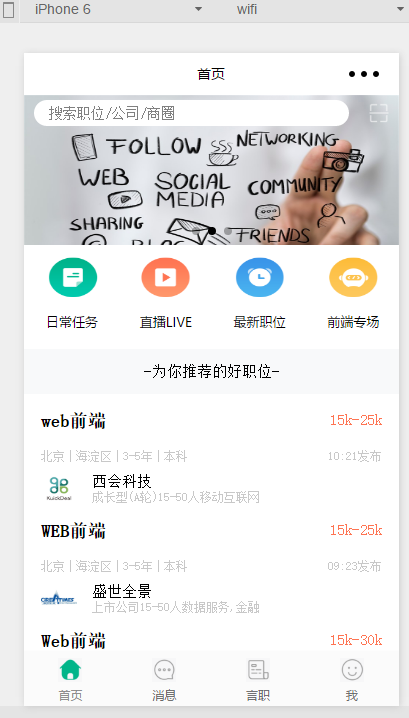
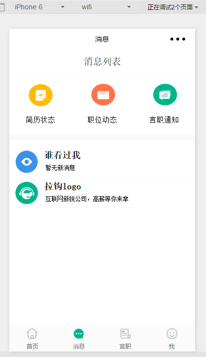

# 微信小程序版拉钩
## 项目目的
熟悉微信小程序的组件和部分API
## 使用方式
 
``` bash
1. git clone https://github.com/yexiaosong/lagou-wechat.git
2. 建议安装http-server,在assets/dbs目录下启动服务。当然也可以把dbs目录下的dbFe.json文件拖到Apache等服务器下的共享目录下。（需要保证8080端口不被占用）
3. 将整体项目拖到微信web开发工具中即可。
```
## 项目说明
+ 布局采用Android端APP中的布局，使用flex弹性盒进行布局。
+ 数据文件抓取的2017.06.23的数据
+ 通过微信API中的请求方式，对后端发送请求。然后前端渲染视图。

## 项目截图
### 首页

### 消息页
